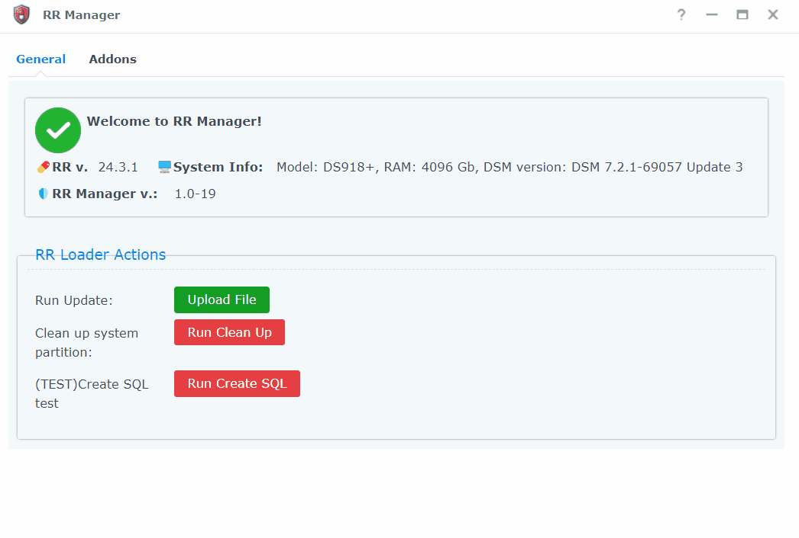

# Что это такое?

RRManager — это приложение Redpill Recovery DSM, предназначенное для обеспечения возможности настройки/обновления RR без загрузки для восстановления RR. Этот пакет предназначен для опытных пользователей.

❗❗❗ Обязательно:не ниже `RR v.24.2.4`

### Функции
 - [x] загрузить и установить обновление из DSM
 - [x] запускать пользовательские задания с помощью ui( clean_system_disk.cgiи т.д..)
 - [x] больше не помечается как вирус 
 - [ ] управлять аддонами (в разработке)

Это приложение построено на DSMплатформе пользовательского интерфейса: Ext.Js 3.4. Я не нашел документации по этой платформе, поэтому потратил много времени на изучение того, как создавать пользовательский интерфейс и вызывать действия DSM, используя этот подход. Вот почему интерфейс такой неидеальный))

# Установка
1. Загрузите spk-файл RR Manager с github
2. Установите SPK, укажите путь для хранения артефактов RR
3. Следуйте инструкциям, чтобы создать необходимые ресурсы.

## Как это работает?
Во время установки приложения вы можете указать папки для хранения артефактов RR во время процесса обновления. Вы также можете выбрать папки и общие ресурсы, созданные во время установки, или заполнить существующие общие ресурсы.

В моем случае общий ресурс rrи временная папка tmp. Таким образом, RR Manager загрузит обновленный файл в файл /volumeX/rr/tmp/update.zip.

Обратите внимание, что вам нужно загрузить updateX.zip(updateall-24.3.0), а не rr-23.11.1.img.zip.

## Меняем язык на русский

1. скачиваем фаил
---

---
2. заменяем по пути:
 - /ваш диск/@appstore/rr-manager/app/texts/rus